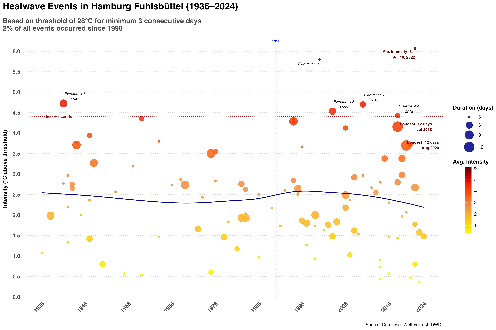
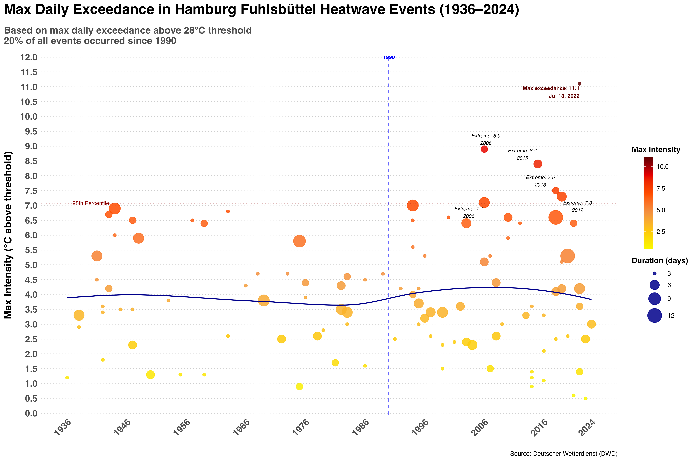
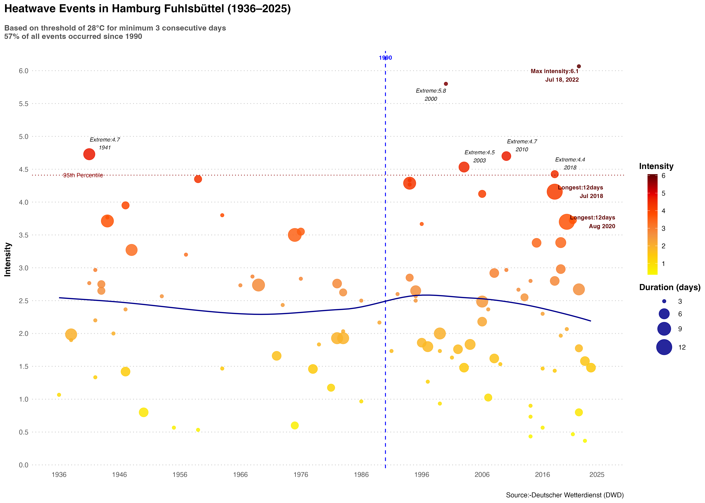

 # Climate Analysis :- 
 The  project is on analysing the Climate data for Hamburg Fuhlsbüttel. 

## Data Source:-
The source for this data is in the following link :- opendata.dwd.de/climate_environment/CDC/observations_germany/climate/daily
The data collected  is from the time period  1936-2024 based on daily frequency. 
Station i.d. :-  Hamburg Fuhlsbüttel Latitutde 53.6332 Longitude is 9.9881 
Note:- The data has not been updated after 2023. In addition the data for other stations is not complete and time frame is small.
So we decided to use another reliable data source NCEI data, which gets a regular update.

#### Analysis 
This research consists of two complementary analyses: first, an examination of climate variables to identify trends and changes; and second, an analysis of drought indices to determine whether they support the identified climate changes. 

# Climate Analysis for Hamburg

## Heatwave Plots

### 1. Heatwave Events

### 2. Max Daily Exceedance

### 3. Heatwaves 1936–2025

## Interactive HTML Reports

- [Hamburg Temperature Analysis](DWD_Folder/Scripts/Hamburg_Temperature_Analysis.html)
- [Climate Overview for Hamburg](DWD_Folder/Scripts/climate_hamburg.html)
- [Decade Comparison](DWD_Folder/Scripts/decade_comparison.html)
- [Heatwave Days Barchart](DWD_Folder/Scripts/heatwave_days_barchart.html)
- [Heatwave Magnitude Timeseries](DWD_Folder/Scripts/heatwave_magnitude_timeseries.html)
- [Magnitude vs Days Scatter](DWD_Folder/Scripts/magnitude_vs_days_scatter.html)
- [Seasonal Timing Analysis](DWD_Folder/Scripts/seasonal_timing.html)

### Drought Analysis:- 

#Note:- DrinC software is commonly used by many , but we find it a bit strange that the default refrence period is Oc-Nov. This results in completely affecting the computation for the drought indces. Especialy for SPI/SPEI index in our case if we are taking from Oct to Nov (next year) then the precipitation is affected as many months do not witness precipitation. For some stations it could be RDI may suffer. We could not find it reasonable enough to accept the DrinC computation. 

# Analysis:- 
We  extend our analysis by focusing on long term trend, so using annual series of drought indices with a frequency of 3,6,9,12 . The plots shows that last decade has witnesses increase in temperature and on the other decrease in precipitation. This makes the situation worse in future as with further increase in temperature the weather will becoe more dry and will result in a further decrease in precipitation resulting in a severe drought. 

## Extension:- We are working on the data for other cities in Germany.

### Software Program:-
R  has been extensively used for the whole analysis, visualiaztion. 

