 # Climate Analysis :- 
 The  project is on analysing the Climate data for Hamburg Fuhlsbüttel. 

## Data Source:-
The source for this data is in the following link :- opendata.dwd.de/climate_environment/CDC/observations_germany/climate/daily
The data collected  is from the time period  1936-2024 based on daily frequency. 
Station i.d. :-  Hamburg Fuhlsbüttel Latitutde 53.6332 Longitude is 9.9881 
Note:- The data has not been updated after 2023. In addition the data for other stations is not complete and time frame is small.
So we decided to use another reliable data source NCEI data, which gets a regular update.

#### Analysis 
This research consists of two complementary analyses: first, an examination of climate variables to identify trends and changes; and second, an analysis of drought indices to determine whether they support the identified climate changes. 

# Climate Analysis for Hamburg Fuhlsbüttel:
I first perform Temperature analysis for  Hamburg Fuhlsbüttel

### Annual Temperature Trend (1936–2024)

### 📊 Decadal Temperature (Bar Plot)

### 📉 Decadal Temperature Trends (Line Plot)

### 🔥 Heatwave Intensity Trend (1990–2024)

### 🌡️ Maximum Daily Exceedance in Heatwaves (1990–2024)

### 🔁 Annual Number of Heatwave Events (HWMId, 1990–2024)

### 🗓️ Julian Day of Peak Heatwave Intensity

### 📅 Frequency of Heatwave Peak Months (1990–2024)

### 📆 Peak Months by Decade

### 🧮 Heatwave Frequency per Climatology Period

### 📊 Frequency of Heatwave Events (Tmax ≥ 28°C, ≥3 Days)

### ↘️ Rate of Decline After Heatwave Peak

### 🐢 Top 10 Slowest Heatwave Declines

### ⏳ Top 10 Longest Duration Heatwave Events

### 📌 Top 10 Heatwaves by Maximum Intensity

#### Precipitation Trend (1936-2025) #### 
.png)

### Precipitation Concentration Index (PCI)
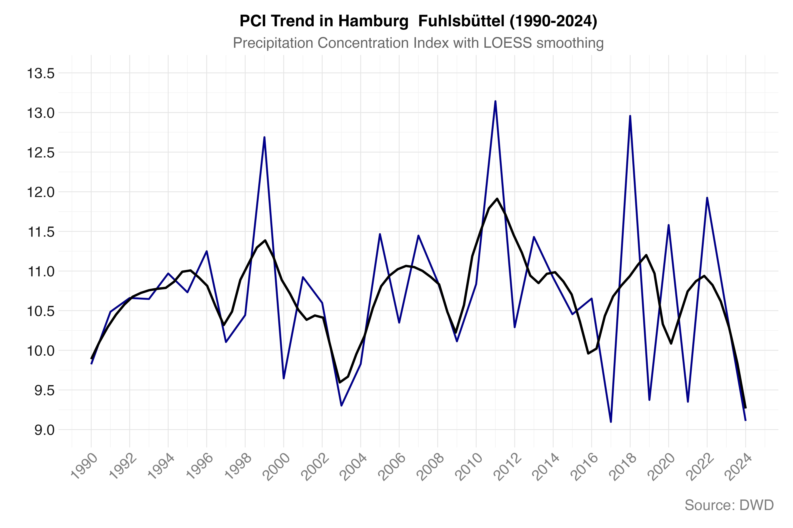

### Key Findings:
### 1. Overall Stability:

### PCI values consistently range between ~9.0-13.5 over 89 years
### Mean appears stable around 10.5-10.6 (moderate concentration)
### No significant long-term trend (black LOESS line is relatively flat)

### 2. Temporal Patterns:

### 1940s-1950s: Higher variability and more frequent spikes above 13
### 1960s-1980s: More stable period with fewer extreme values
### 1990s-2020s: Return to higher variability, similar to 1940s-1950s

### 3. Climate Implications:Hamburg maintains moderate seasonal precipitation concentration throughout the recordNo evidence of increasing concentration due to climate changeThe variability suggests natural climate oscillations rather than systematic change

### 4. Extreme Years:Several years show PCI >13 (irregular distribution): notably in 1940s, 1960s, and 2000s-2010sThese likely represent years with particularly wet or dry seasons
### German Climate Context Analysis:Regional Climate Influences: Hamburg, being in northern Germany near the North Sea, is particularly influenced by Atlantic weather systems and the North Atlantic Oscillation (NAO). The cyclical peaks you see (1999, 2011, 2018) likely correspond to periods when these Atlantic systems created more concentrated precipitation patterns.Seasonal Concentration: In Germany's temperate oceanic climate, high PCI values often indicate: Wet winters followed by dry summers (or vice versa).Clustering of precipitation into fewer, more intense events.Potential impacts from blocking high-pressure systems over Central Europe

### Climate Change Signals: The increasing volatility after 2010 aligns with observed climate change impacts in Germany, including: More frequent extreme weather events,Shifts in seasonal precipitation patterns.Increased likelihood of both drought periods and heavy rainfall events Recent Trends (2020-2024): The declining trend toward 2024 might reflect:Changes in storm track patterns affecting northern Germany.Potential shifts in the timing or intensity of Atlantic low-pressure systems.Regional impacts of broader European climate variability Agricultural/Hydrological Implications: For Hamburg and northern Germany, these PCI fluctuations have significant implications for water management, agriculture, and flood risk - particularly given the region's importance for German agriculture and its proximity to major river systems.The data suggests Hamburg has experienced increasingly variable precipitation concentration patterns, which is consistent with climate projections for Northern European regions.

### Average Duration Spell
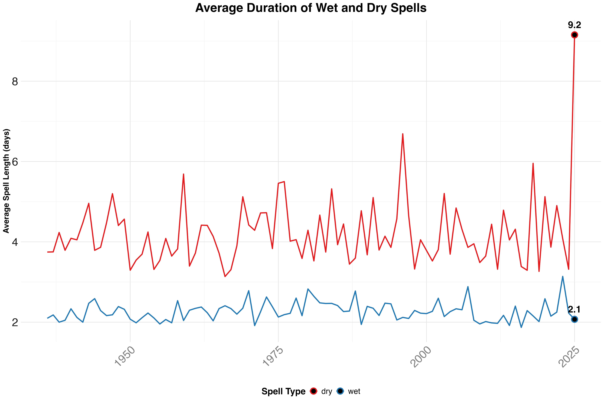

### Seasonal Precipitation Analysis

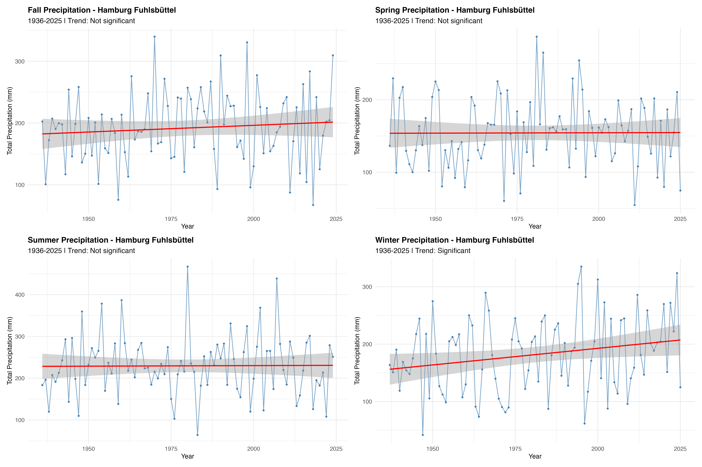

### Spring Season
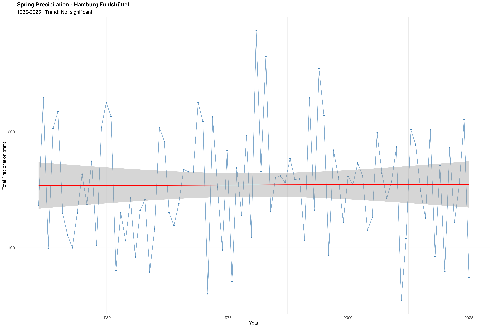
### Summer Season
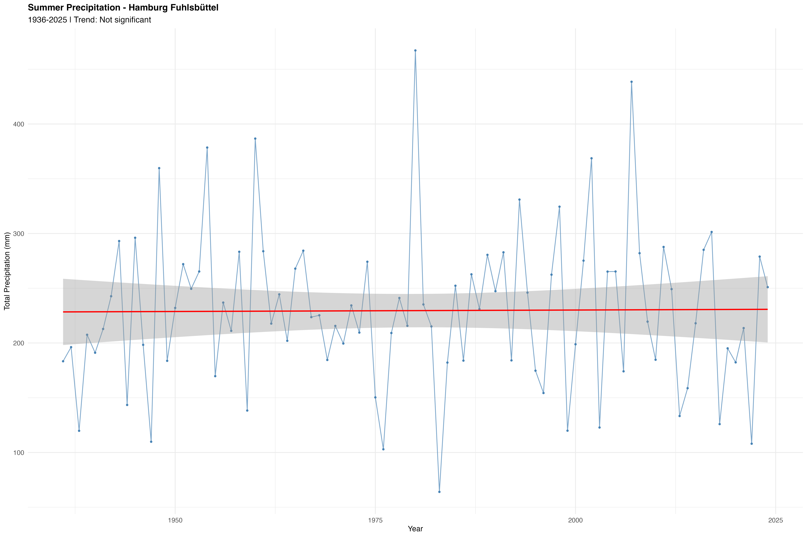
### Fall Season
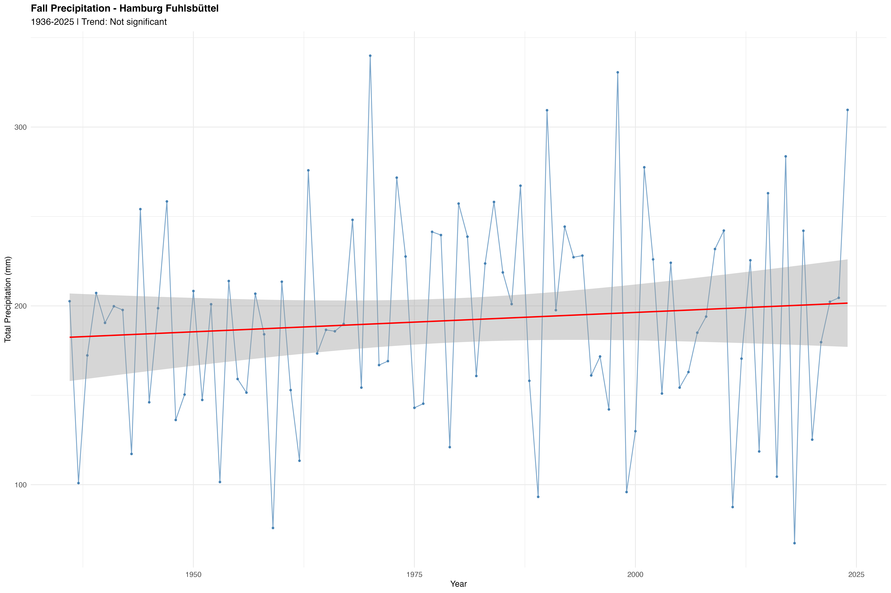
### Winter Season
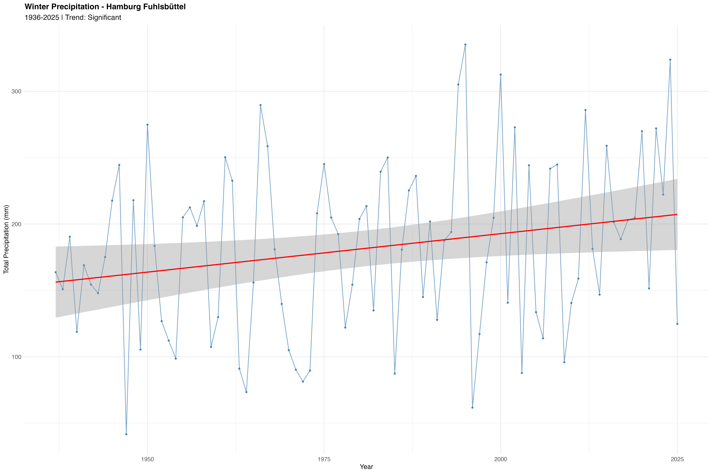

### Comparison of Period 1936:1979 & 1980:2025 for Winter Season

### Drought Analysis:- 
#### Analysis:- 
Focus is on long term trend, so using monthly series of drought indices with a frequency of 12,36,24,48 . The plots shows that last decade has witnesses increase in temperature and on the other decrease in precipitation. This makes the situation worse in future as with further increase in temperature the weather will become more dry and will result in a further decrease in precipitation resulting in a severe drought. 

### The Reconnaissance Drought Index (RDI) is a meteorological drought index that assesses drought severity by comparing precipitation to potential evapotranspiration (PET). It's a valuable tool for understanding water availability and is often used in agriculture and water resource management.
### RDI 12 monthly Index
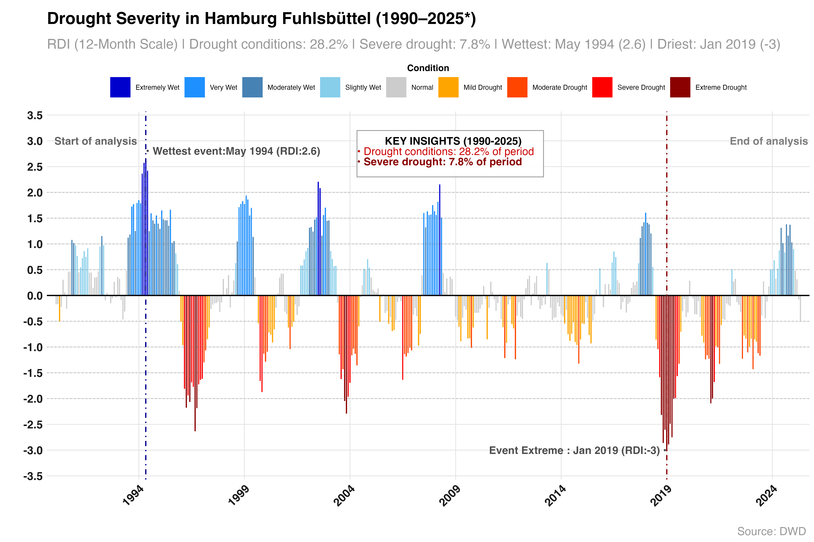

### RDI 24 monthly Index
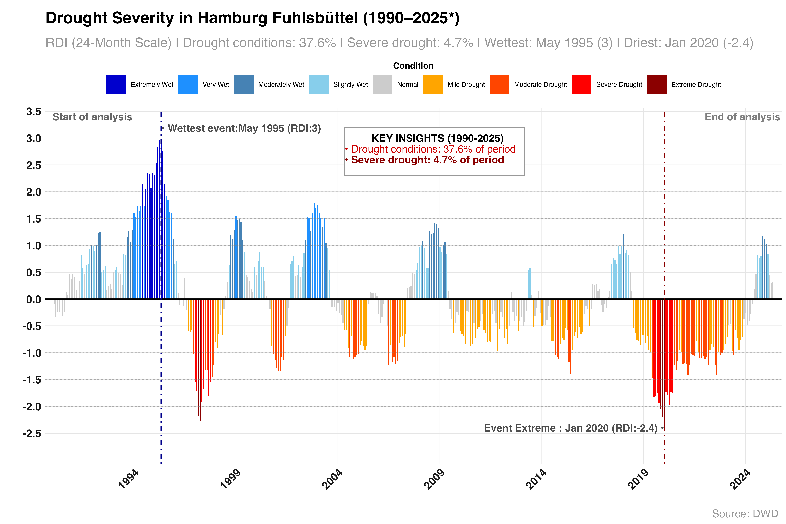

### RDI 36 monthly Index
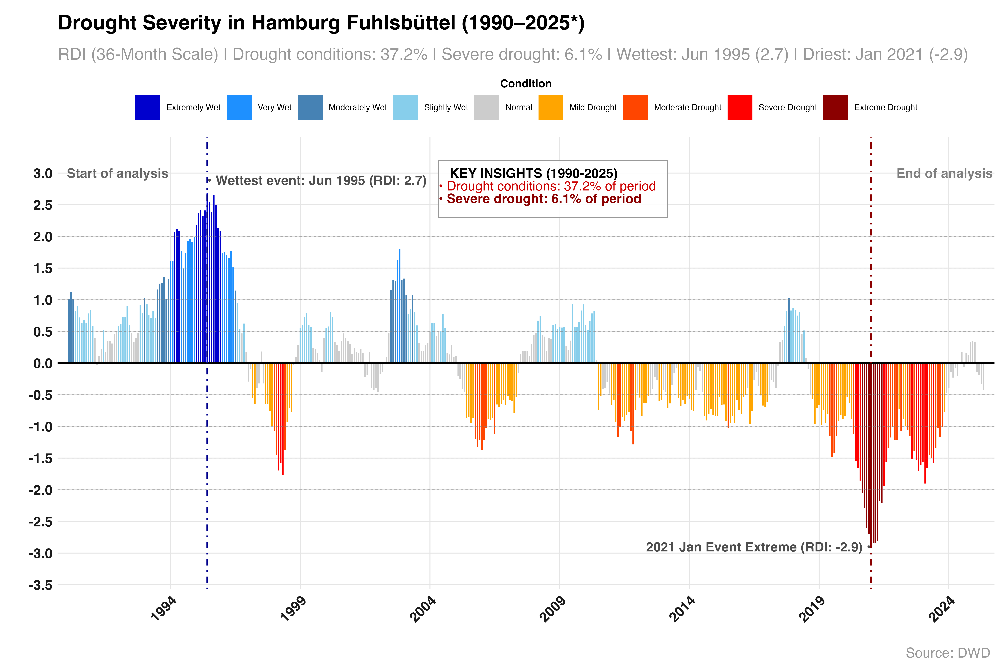

### RDI 48 monthly Index
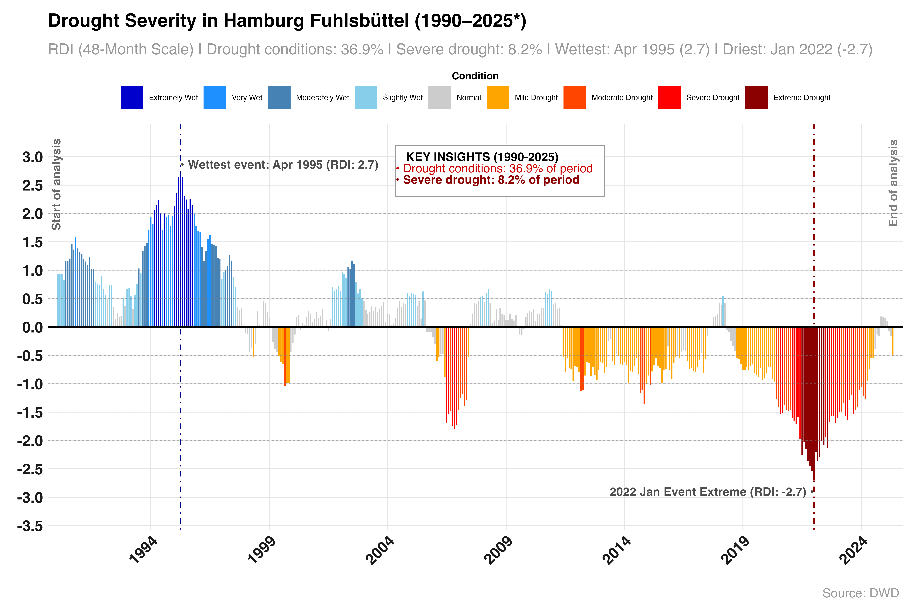

Inference and Analysis:
### The 12-month RDI analysis for Hamburg Fuhlsbüttel from 1990 to 2025 reveals a shifting pattern in annual drought dynamics. While the early 1990s experienced substantial wet conditions—including the wettest period in May 1994 (RDI = 2.6)—recent decades have seen more frequent and intense droughts, culminating in the extreme event of January 2019 (RDI = -3.0). Overall, 28.2% of the period was marked by drought (RDI < -0.5), and 7.8% experienced severe drought (RDI < -1.5), indicating a significant increase in water stress risk, particularly in the last decade. These findings emphasize the importance of ongoing monitoring and adaptation strategies, especially in light of potential climate-driven shifts in hydrological cycles.
### The 24-month RDI trend for Hamburg Fuhlsbüttel from 1990 to 2024 reveals significant interannual variability in drought and wet conditions. While early decades (especially the 1990s) showed frequent and intense wet periods, the most recent decade has been characterized by prolonged dry conditions, culminating in the driest month observed in January 2020 (RDI = -2.4). Overall, drought conditions were present during 37.6% of the study period, with 4.7% classified as severe. This indicates increasing susceptibility to long-term water stress, especially post-2010.
### 📌 Key Insights:
### Consistency in Wettest Period: Both time scales agree that the wettest period was mid-1990s (Apr/Jun 1995), with very high RDI values (~2.7), reflecting a notably wet phase.
### Recent Severe Droughts: The 36-month RDI captures Jan 2021 as the driest event (RDI = -2.9), showing short-term sharp intensity.The 48-month RDI, being smoother, flags Jan 2022 as driest (RDI = -2.7), representing longer accumulation of drought.Severe Drought Frequency:The 48-month RDI shows greater severe drought coverage (8.2%), suggesting that longer drought episodes have become more prominent in recent decades.

## Post-2010 Trends:Both plots highlight an extended period of drying since ~2012, but 48-month scale smooths short-term variability, emphasizing longer-term water deficits.
### 🧠 Interpretation:36-Month RDI is slightly more sensitive to shorter-term severe fluctuations but still shows significant long-term stress.48-Month RDI better captures multi-year cumulative drought, making it a more robust indicator of sustained hydrological stress.The strong downward trends in both cases underline the intensifying drought risk, with the 48-month index suggesting deeper and more persistent impacts.

### Comparative Summary of RDI Indices (1990–2025)

| RDI Scale   | Drought (%) | Severe Drought (%) | Wettest Event      | Driest Event       | Kendall’s Tau |    Trend Significance |
|-------------|-------------|---------------------|---------------------|---------------------|----------------|---------------------|
| 12-Month    | 28.2%       | 7.8%                | May 1994 (2.6)      | Jan 2019 (-3.0)     | -0.163         | ✓                   |
| 24-Month    | 37.6%       | 4.7%                | May 1995 (3.0)      | Jan 2020 (-2.4)     | -0.282         | ✓                   |
| 36-Month    | 37.2%       | 6.1%                | Jun 1995 (2.7)      | Jan 2021 (-2.9)     | -0.438         | ✓✓                  |
| 48-Month    | 36.9%       | 8.2%                | Apr 1995 (2.7)      | Jan 2022 (-2.7)     | -0.563         | ✓✓✓                 |

### Software Program:-
R  has been extensively used for the whole analysis, visualiaztion. 

