 # Climate Analysis :- 
 This  project  analyses  the Climate data for Hamburg Fuhlsbüttel. 
## Data Source:-
The source for this data is in the following link :- opendata.dwd.de/climate_environment/CDC/observations_germany/climate/daily
The data collected  is from the time period  1936-2025(May) based on daily frequency. 
Station i.d. :-  Hamburg Fuhlsbüttel Latitutde 53.6332 Longitude is 9.9881

# Analysis is done in following steps
1) Temperature
2) Precipitation
3) Drought Indices

# Temperature Analysis
I first perform Temperature analysis for  Hamburg Fuhlsbüttel

Annual Temperature Trend (1936–2024)

 📊 Decadal Temperature (Bar Plot)

 📉 Decadal Temperature Trends (Line Plot)

 🔥 Heatwave Intensity Trend (1990–2024)

 🌡️ Maximum Daily Exceedance in Heatwaves (1990–2024)

 🔁 Annual Number of Heatwave Events (HWMId, 1990–2024)

 🗓️ Julian Day of Peak Heatwave Intensity

 📅 Frequency of Heatwave Peak Months (1990–2024)

 📆 Peak Months by Decade

 🧮 Heatwave Frequency per Climatology Period

 📊 Frequency of Heatwave Events (Tmax ≥ 28°C, ≥3 Days)

 ↘️ Rate of Decline After Heatwave Peak

 🐢 Top 10 Slowest Heatwave Declines

 ⏳ Top 10 Longest Duration Heatwave Events

 📌 Top 10 Heatwaves by Maximum Intensity

# Precipitation Analysis
 Precipitation Trend (1936-2025) #### 
.png)

 Precipitation Concentration Index (PCI)

# Key Findings:
 1. Overall Stability:
 PCI values consistently range between ~9.0-13.5 over 89 years
 Mean appears stable around 10.5-10.6 (moderate concentration)
 No significant long-term trend (black LOESS line is relatively flat)

 2. Temporal Patterns:
1940s-1950s: Higher variability and more frequent spikes above 13
 1960s-1980s: More stable period with fewer extreme values
1990s-2020s: Return to higher variability, similar to 1940s-1950s

 3. Climate Implications:
Hamburg maintains moderate seasonal precipitation concentration throughout the recordNo evidence of increasing concentration due to climate changeThe variability suggests natural climate oscillations rather than systematic change

 4. Extreme Years:
Several years show PCI >13 (irregular distribution): notably in 1940s, 1960s, and 2000s-2010sThese likely represent years with particularly wet or dry seasons
 German Climate Context Analysis:Regional Climate Influences: Hamburg, being in northern Germany near the North Sea, is particularly influenced by Atlantic weather systems and the North Atlantic Oscillation (NAO). The cyclical peaks you see (1999, 2011, 2018) likely correspond to periods when these Atlantic systems created more concentrated precipitation patterns.Seasonal Concentration: In Germany's temperate oceanic climate, high PCI values often indicate: Wet winters followed by dry summers (or vice versa).Clustering of precipitation into fewer, more intense events.Potential impacts from blocking high-pressure systems over Central Europe

# Climate Change Signals: 
The increasing volatility after 2010 aligns with observed climate change impacts in Germany, including: More frequent extreme weather events,Shifts in seasonal precipitation patterns.Increased likelihood of both drought periods and heavy rainfall events Recent Trends (2020-2024): The declining trend toward 2024 might reflect:Changes in storm track patterns affecting northern Germany.Potential shifts in the timing or intensity of Atlantic low-pressure systems.Regional impacts of broader European climate variability Agricultural/Hydrological Implications: For Hamburg and northern Germany, these PCI fluctuations have significant implications for water management, agriculture, and flood risk - particularly given the region's importance for German agriculture and its proximity to major river systems.The data suggests Hamburg has experienced increasingly variable precipitation concentration patterns, which is consistent with climate projections for Northern European regions.

# Average Duration Spell

# Seasonal Precipitation Analysis

Spring Season

 Summer Season

 Fall Season

 Winter Season

 Comparison of Period 1936:1979 & 1980:2025 for Winter Season
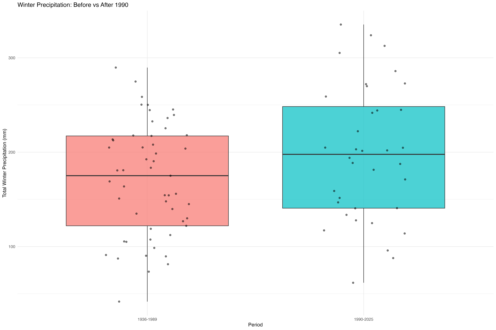

# Analysis & Inference from Precipitation:
1980 Breakpoint Analysis:
Mean increase: 30.8mm (166mm → 197mm)
Percentage increase: 18.6%
Median increase: 38mm (164mm → 202mm)
Variability: Standard deviation increased from 60.3mm to 67.2mm

1990 Breakpoint Analysis:
Mean increase: 27.3mm (171mm → 198mm)
Percentage increase: 16.0%
Median increase: 23mm (175mm → 198mm)
Variability: Standard deviation increased from 59.5mm to 71.2mm

Key observations:
Both breakpoints show substantial increases (~16-19%), confirming the trend is robust
The 1980 breakpoint shows a slightly larger absolute increase (30.8mm vs 27.3mm), suggesting the trend started earlier but was more gradual
The 1990 breakpoint shows the trend is more concentrated in the recent period (36 years vs 46 years)
Increased variability in both cases - winters are not only getting wetter on average, but also more variable (higher standard deviation)
The medians follow similar patterns to the means, indicating this isn't driven by a few extreme years

Climate implications:
An 18% increase in winter precipitation over ~45 years is climatologically significant
The increased variability suggests more extreme wet and dry winters
This aligns with climate projections for Northern Europe showing wetter winters

This is a clear signal of changing winter precipitation patterns at Hamburg Fuhlsbüttel!

### Drought Analysis:- 

# Analysis:- 
Focus is on long term trend, so using monthly series of drought indices with a frequency of 12,36,24,48 . The plots shows that last decade has witnesses increase in temperature and on the other decrease in precipitation. This makes the situation worse in future as with further increase in temperature the weather will become more dry and will result in a further decrease in precipitation resulting in a severe drought. 

# The Reconnaissance Drought Index (RDI) is a meteorological drought index that assesses drought severity by comparing precipitation to potential evapotranspiration (PET). It's a valuable tool for understanding water availability and is often used in agriculture and water resource management.
## RDI 12 monthly Index
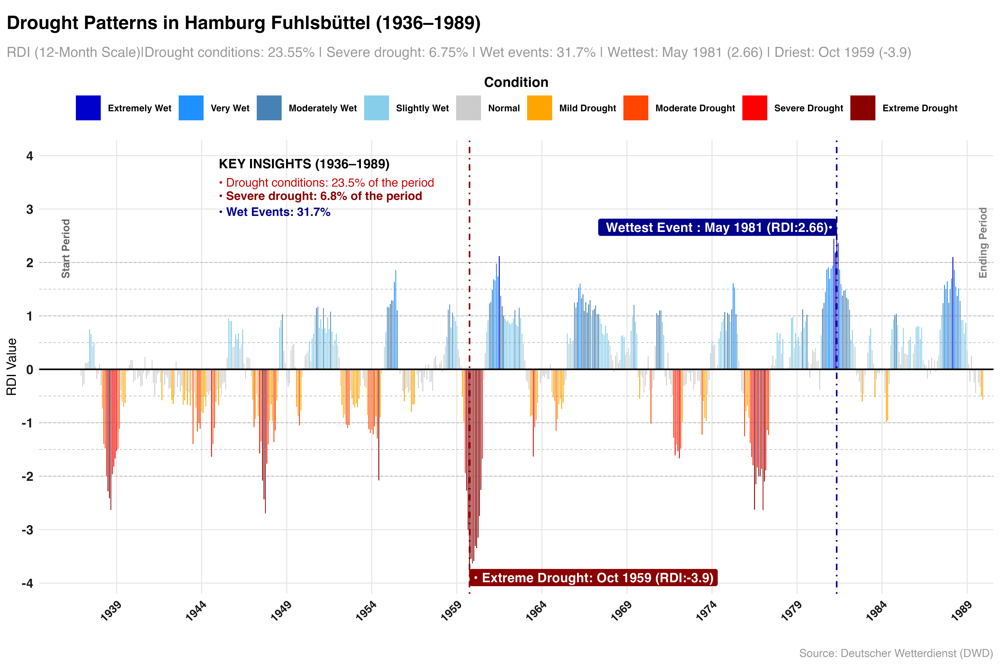
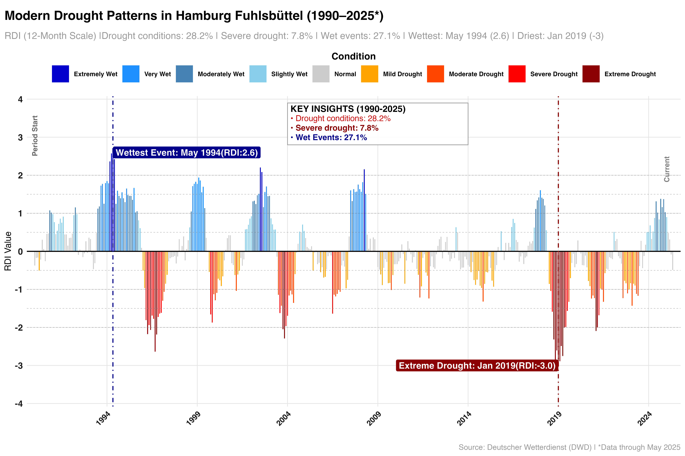
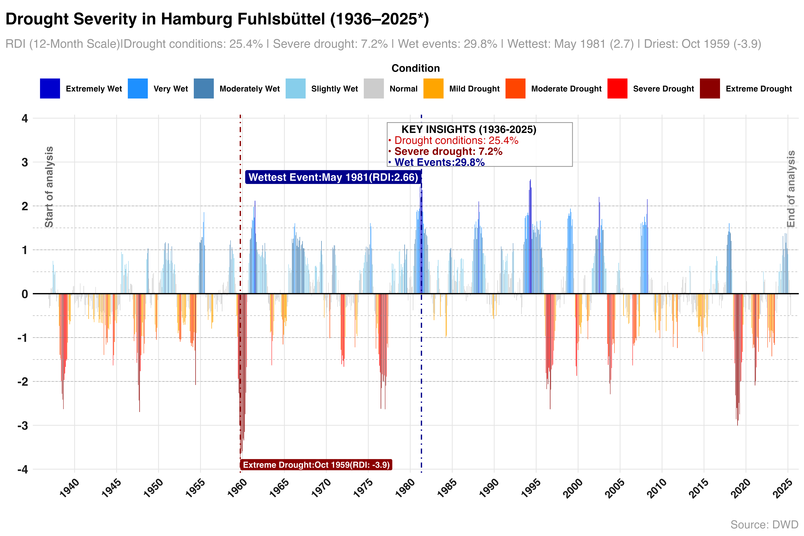

## RDI 24 monthly Index
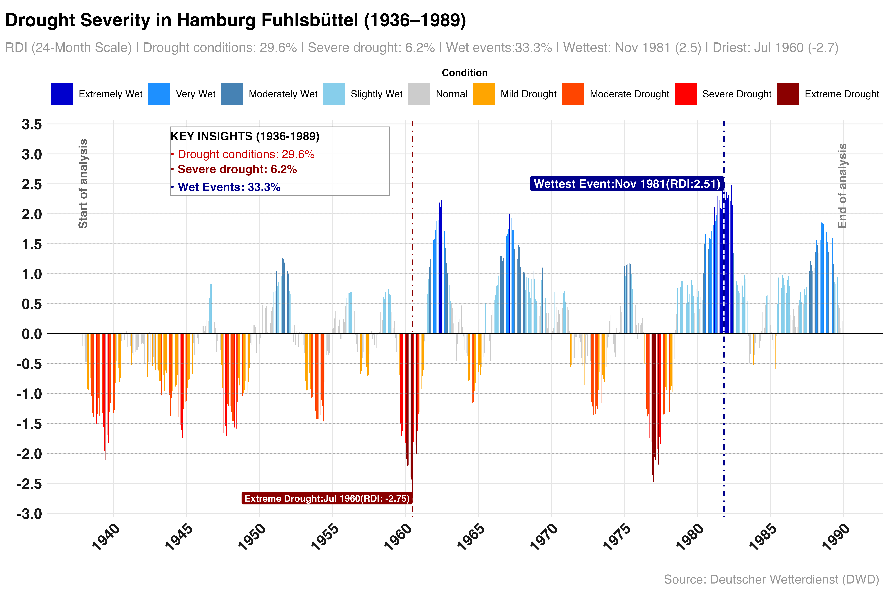
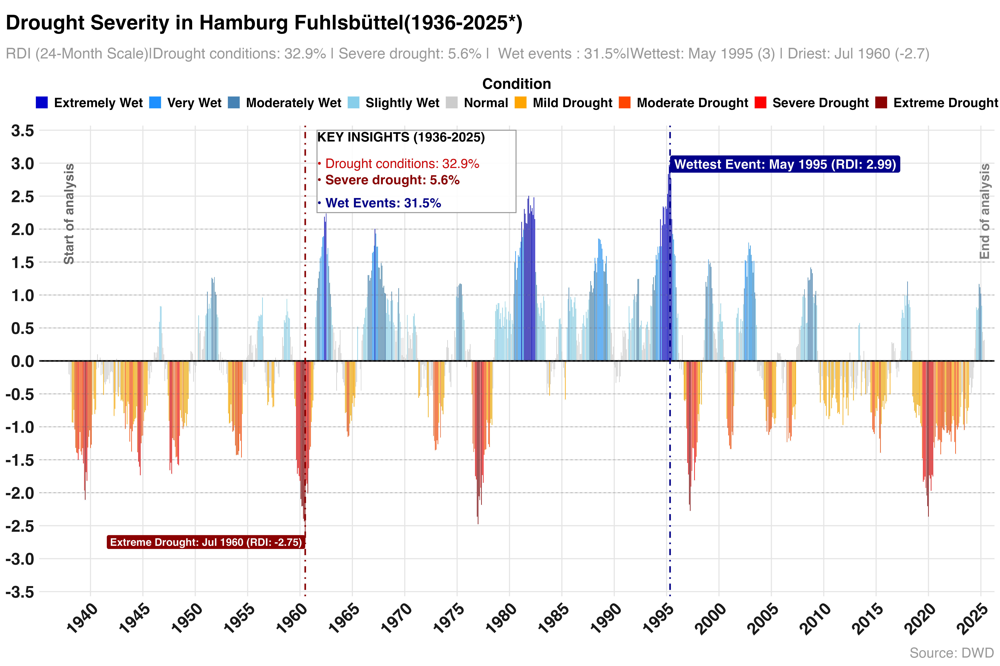

## RDI 36 monthly Index
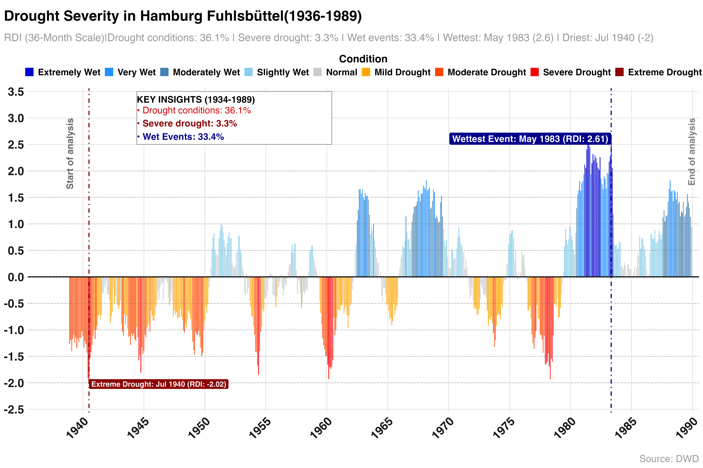
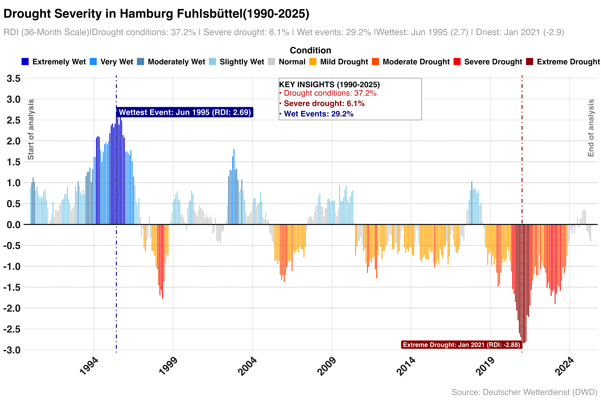
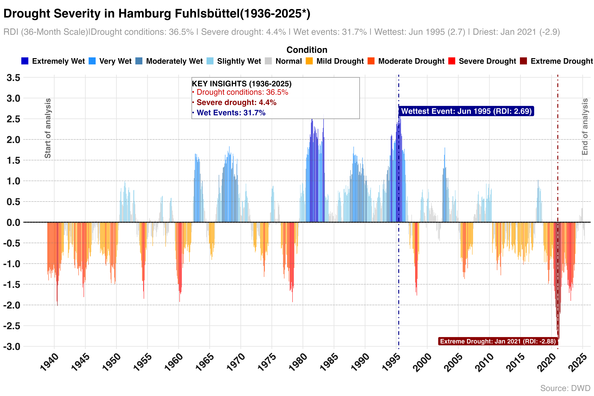

## RDI 48 monthly Index
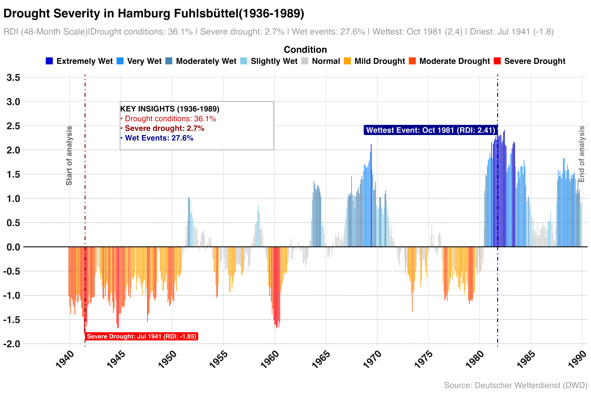
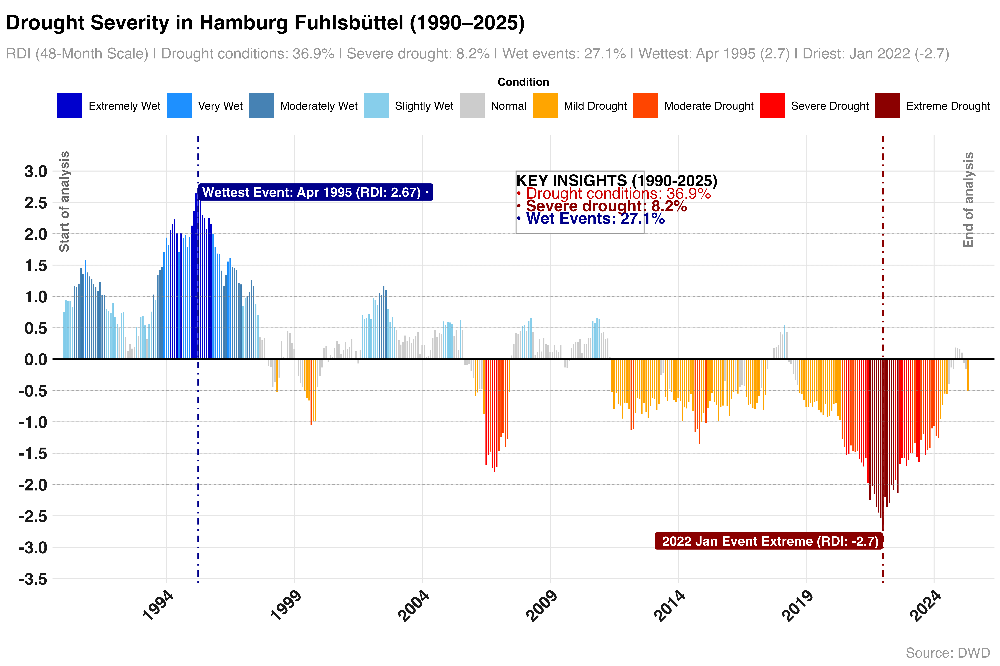
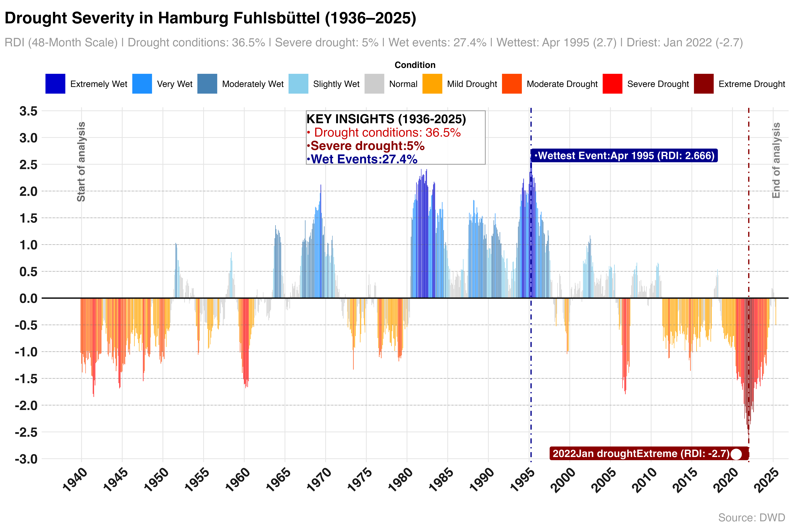

# Critical Insights:
# Scale-Dependent Drought Evolution:

12-month: High variability, frequent short droughts
24-month: Intermediate persistence, moderate severity increases
36-48 month: Dramatic modern intensification of severe droughts

Temporal Transition Patterns:

1959-1960: Historic extreme drought cluster across 12-24 month scales
1990s: Major wet period peak (especially May 1995)
2018-2022: New drought era with unprecedented long-term severity

Modern Climate Signal Strength by Scale:

12-month: Moderate increase (6.8% → 7.8% severe drought)
24-month: Slight decrease (6.2% → 5.6% in full period)
36-month: Nearly doubled (3.3% → 6.1% severe drought)
48-month: Tripled (2.7% → 8.2% severe drought)

Most Concerning Finding:
The 48-month scale shows the strongest climate change signal, indicating that multi-year drought persistence has fundamentally changed in Hamburg's climate system.

Hydrological Implications:

Short-term droughts (12-24 months): Affect seasonal water management
Long-term droughts (36-48 months): Threaten groundwater recharge, ecosystem resilience, and agricultural sustainability
The tripling of severe long-term droughts represents a major shift in regional water security

This analysis clearly shows that while short-term drought variability has increased moderately, the most dramatic change is in sustained multi-year drought conditions - exactly the type that poses the greatest challenge to water resources and ecosystem adaptation.

### **Reconnaissance Drought Index (RDI) Summary: Hamburg Fuhlsbüttel**

| **Time Scale** | **Period**     | **Drought Conditions** | **Severe Drought** | **Wet Events** | **Key Extreme (Dry)**     |
|----------------|----------------|-------------------------|---------------------|----------------|---------------------------|
| **12-month**   | 1936–1989      | 23.6%                   | 6.8%                | 31.7%          | Oct 1959 (**−3.9**)       |
|                | 1990–2025      | 28.2%                   | 7.8%                | 27.1%          | Jan 2019 (**−3.0**)       |
| **24-month**   | 1936–1989      | 29.6%                   | 6.2%                | 33.3%          | Jul 1960 (**−2.7**)       |
|                | 1936–2025      | 32.9%                   | 5.6%                | 31.5%          | Jul 1960 (**−2.75**)      |
| **36-month**   | 1936–1989      | 36.1%                   | 3.3%                | 33.4%          | Jul 1940 (**−2.0**)       |
|                | 1990–2025      | 37.2%                   | 6.1%                | 29.2%          | Jan 2021 (**−2.9**)       |
| **48-month**   | 1936–1989      | 36.1%                   | 2.7%                | 27.6%          | Jul 1941 (**−1.85**)      |
|                | 1990–2025      | 36.9%                   | 8.2%                | 27.1%          | Jan 2022 (**−2.7**)       |

# Mann Kendall Trend Test summary
| **Scale** | **Period** | **Tau**     | **Z-statistic** | **p-value**  | **Trend Direction**  | **Significance** |
| --------- | ---------- | ----------- | --------------- | ------------ | -------------------- | ---------------- |
| 12-month  | 1936–2025  | +0.0232     | 1.133           | 0.2572       | Slight Increase      | ✗ (not sig.)     |
| 24-month  | 1936–2025  | +0.0353     | 1.711           | 0.0871       | Mild Increase        | (•) (10% level)  |
| 36-month  | 1936–2025  | +0.0434     | 2.093           | **0.0364**   | Moderate Increase    | ✓                |
| 48-month  | 1936–2025  | +0.0528     | 2.534           | **0.0113**   | Moderate Increase    | ✓✓               |
| 12-month  | 1936–1989  | +0.2098     | 7.920           | < 2.4e-15    | Strong Increase      | ✓✓✓              |
| 24-month  | 1936–1989  | +0.3233     | 12.088          | < 2.2e-16    | Strong Increase      | ✓✓✓              |
| 36-month  | 1936–1989  | +0.3839     | 14.215          | < 2.2e-16    | Strong Increase      | ✓✓✓              |
| 48-month  | 1936–1989  | +0.4417     | 16.194          | < 2.2e-16    | Strong Increase      | ✓✓✓              |
| 12-month  | 1990–2025  | **−0.1626** | −5.008          | **5.49e-07** | Moderate Decrease    | ✓✓✓              |
| 24-month  | 1990–2025  | **−0.2820** | −8.678          | < 2.2e-16    | Strong Decrease      | ✓✓✓              |
| 36-month  | 1990–2025  | **−0.4383** | −13.497         | < 2.2e-16    | Strong Decrease      | ✓✓✓              |
| 48-month  | 1990–2025  | **−0.5629** | −17.337         | < 2.2e-16    | Very Strong Decrease | ✓✓✓              |

# Interpretation:-
 Interpretation
1936–1989: All time scales show strong positive trends — conditions became wetter or less drought-prone.

1990–2025: Clear negative trends — longer scales (36, 48 months) show increasingly severe and prolonged drought conditions.

1936–2025: Full-period trends are mild and mixed — overall signal is weaker due to opposite trends in sub-periods.

### Software Program:-
R  has been extensively used for the whole analysis, visualiaztion. 

