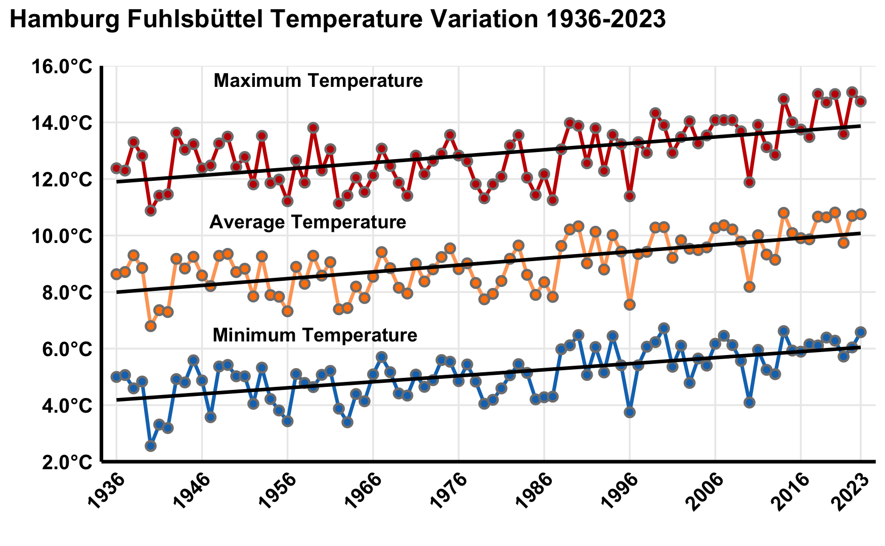
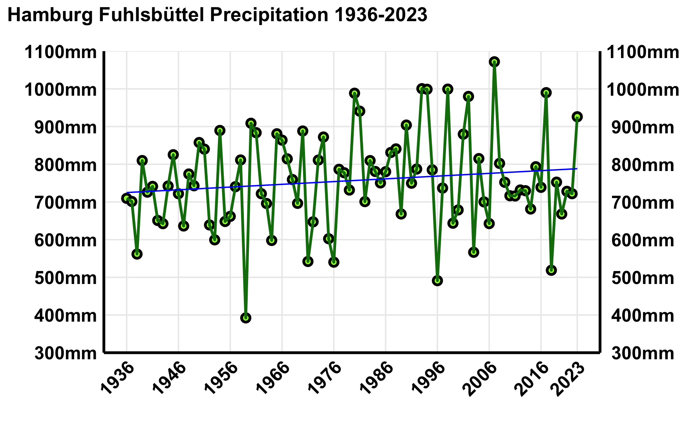

 # Climate Analysis :- 
 The  project is on analysing the Climate data for Hamburg. 

## Data Source:-
The source for this data is in the following link :- opendata.dwd.de/climate_environment/CDC/observations_germany/climate/daily
The data collected  is from the time period  1936-2023 based on daily frequency. 
Station i.d. :-  Hamburg Fuhlsbüttel Latitutde 53.6332 Longitude is 9.9881 
Note:- The data has not been updated after 2023. In addition the data for other stations is not complete and time frame is small.
So we decided to use another reliable data source NCEI data, which gets a regular update.

#### Analysis 
This research consists of two complementary analyses: first, an examination of climate variables to identify trends and changes; and second, an analysis of drought indices to determine whether they support the identified climate changes. 

##### Climate Variables
  # Temperature  :-  The plot for the temperature variations 1936-2023 is given as below.  

We can clearly see that the temperature is rising over last decade. 

## Precipitation :-  The plot for precipitation from 1936-2023 is given as below
  

We can clearly see tha the precipitation over last decade is declining. Although the trend line (linear) is slopng upwards but the absolute value is decreasing over the decade.

### Drought Analysis:- 

# Drought:-  When We speak of drought, we see that it is based on the climate conditions. For analysis we compute the drought indices SPI,RDI and SPEI based on monthly and annual frequency. We find that SPI index is not that good indicator  for the Hamburg, while RDI and SPEI gives use a clear indications for the changes in the climate condiitions.

### Drought Indices ### 

##SPI Index :- Standardized Precipitation index (SPI) 
The Standardized Precipitation Index (SPI) is the most commonly used indicator worldwide fordetecting and characterizing meteorological droughts. The SPI indicator, which was developed by McKee et al. (1993), and described in detail by Edwards and McKee (1997), measures precipitation anomalies at a given location, based on a comparison of observed total precipitation amounts for an accumulation period of interest (e.g. 1, 3,6,9, 12, 24,48 months), with the long-term historic rainfallrecord for that period. The historic record is fitted to a probability distribution (the “gamma” distribution), which is then transformed into a normal distribution such that the mean SPI value for
that location and period is zero. For any given region, increasingly severe rainfall deficits (i.e.,meteorological droughts) are indicated as SPI decreases below ‒1.0, while increasingly severe excess rainfall are indicated as SPI increases above 1.0. Because SPI values are in units of standard deviation from the long-term mean, the indicator can be used to compare precipitation anomalies for any geographic location and for any number of time-scales. Note that the name of the indicator
is usually modified to include the accumulation period. Thus, SPI-3 and SPI-12, for example, refer to accumulation periods of three and twelve months, respectively. 

## SPEI Index :- Standardised Precipitation Evapotranspiration Index (SPEI) 
The Standardized Precipitation Evapotranspiration Index (SPEI) is an extension of the widely used Standardized Precipitation Index (SPI). The SPEI is designed to take into account both precipitation and potential evapotranspiration (PET) in determining drought. Thus, unlike the SPI, the SPEI captures the main impact of increased temperatures on water demand. Like the SPI, the SPEI can be calculated on a range of timescales from 1-48 months.

## RDI Index:- Reconniasance Drought Index (RDI)
The Reconnaissance Drought Index (RDI) has been introduced by Tsakiris and Vangelis [24] as a physically based, universal and comprehensive index for the assessment of meteorological drought. It utilises two parameters, thecumulative precipitation (P) and potential evapotranspiration (PET), for specified reference periods. Recent studies have shown that temperature methods for estimating PET can be sufficient for the calculation of RDI in various regions, therefore the data requirements are limited to precipitation and temperature. Over the last decade, the RDI has been widely used in several applications worldwide. 

#Note:- DrinC software is commonly used by many , but we find it a bit strange that the default refrence period is Oc-Nov. This results in completely affecting the computation for the drought indces. Especialy for SPI/SPEI index in our case if we are taking from Oct to Nov (next year) then the precipitation is affected as many months do not witness precipitation. For some stations it could be RDI may suffer. We could not find it reasonable enough to accept the DrinC computation. 

# Analysis:- 
We  extend our analysis by focusing on long term trend, so using annual series of drought indices with a frequency of 3,6,9,12 . The plots shows that last decade has witnesses increase in temperature and on the other decrease in precipitation. This makes the situation worse in future as with further increase in temperature the weather will becoe more dry and will result in a further decrease in precipitation resulting in a severe drought. 

## Extension:- We are working on the data for other cities in Germany.

### Software Program:-
R  has been extensively used for the whole analysis, visualiaztion. 

